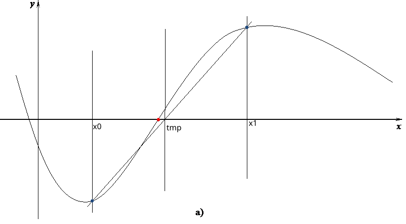
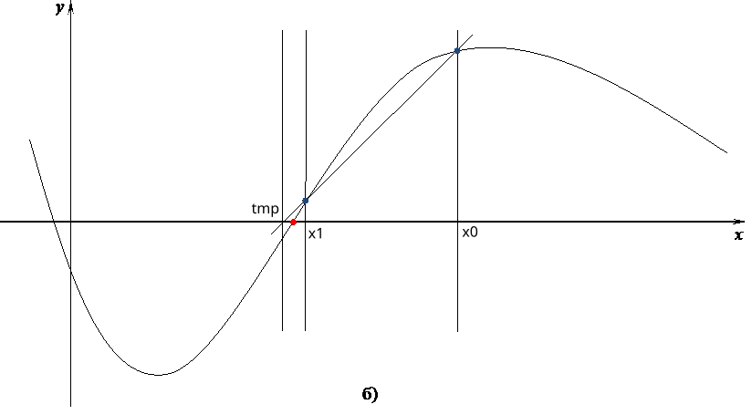
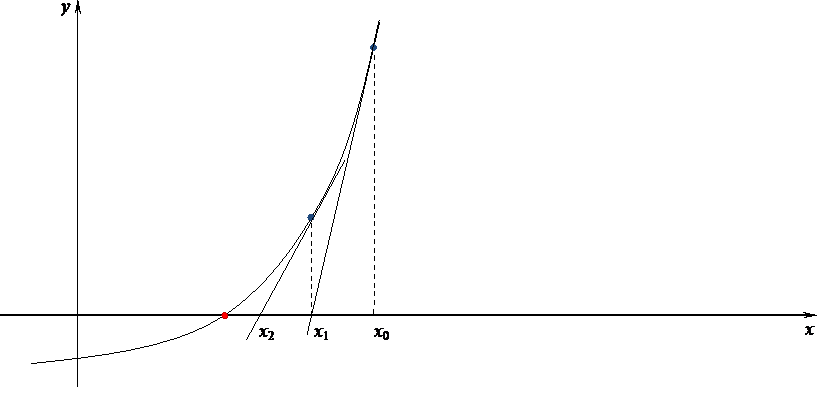

# Приближённые вычисления
Разработать программу для приближённого нахождения корня уравнения f(x) = 0 для нескольких (не менее 5) функций. Функции f(x) берутся из задачника – лабораторный практикум по курсу «Основы программирования», лабораторная работа № 5. Номер функции вводится. Для выбора функции **не** использовать операторы выбора _if_ и _case_.

Корень уравнения находится тремя методами – методом секущих, методом простых итераций и методом Ньютона. Функция, для которой ищется корень, передаётся в процедуру, реализующую метод нахождения корня, с помощью функционального типа.

Для определения начального приближения необходимо построить график функции.

Корень уравнения определяется с заданной точностью ε. Для каждого метода нужно также  считать количество итераций, необходимых для вычисления корня. Осуществлять выход из цикла, когда количество итераций превышает заданное значение. Количество итераций  передавать в основную программу по желанию пользователя через параметр типа указатель на целое со значением по умолчанию, равным nil.

В качестве результата нужно вывести значение корня, значение функции в корне и количество итераций или сообщение о том, что превышено максимально допустимое количество итераций. Количество знаков после десятичной точки должно соответствовать введённой точности.

Осуществлять проверку аномалий. Для завершения выполения программы можно использовать  операцию exit.


### МЕТОД ПРОСТЫХ ИТЕРАЦИЙ.
Используется в том случае, если уравнение можно выразить в виде x = f(x).
Тогда корень уравнения является пересечением прямой y=x и кривой y=f(x).
Данный метод записывается в виде рекуррентной формулы:

```
		x_0 = x начальное
        x_i = f(x_(i-1)) для i ∈ ℕ.
```
образующая последовательность _x\_1, x\_2, x\_3..._, сходящуюся к корню
уравнения при определённых условиях. Повторяем процесс до выполнения ус-я

```
		|x_i - x_(i-1)| ⩽ ε
```


### МЕТОД  СЕКУЩИХ.
Для метода секущих необходимы два начальных приближения _x0_ и _x1_, в качестве которых берутся границы исходного отрезка [_a, b_]. Используя эти два приближения, находим третье приближение _tmp_ как точку пересечения прямой, проведенной между точками (_x0, f(x0)_) и (_x1, f(x1)_), с осью _x_ по следующей формуле:
```pascal
tmp:= x1 - (f(x1)*(x1 - x0)) / (f(x1) - f(x0));
```
После этого самая старая точка _x0_ отбрасывается, и в качестве следующих приближений берутся точки _x1_ и _tmp_ по следующему правилу: `x0:= x1;`, `x1:= tmp`. После чего снова вычисляется следующее приближение по приведённой выше формуле. Процесс вычисления прекращается, когда разность между двумя текущими приближениями становится меньше точности, т.е. когда выполняется условие `abs(x0 – x1) < e`



Метод секущих обычно сходится достаточно быстро, но он чувствителен к выбору начального приближения. Для метода секущих требуется, чтобы производная функции на отрезке, ограниченном начальными приближениями, не менялась слишком быстро, иначе метод начнёт расходиться, т.е. каждое следующее приближение будет удаляться от корня уравнения. 

### МЕТОД НЬЮТОНА
Пусть имеется _x0_ – начальное приближение к корню уравнения _f_(_x_) = 0. Проведём касательную к графику _y = f_(_x_) в точке с координатами (_x0, f_(_x0_)). Новоё приближение к корню получим как точку пересечения этой касательной с осью абсцисс. Это правило приводит к следующей расчётной формуле: 
`x1:= x0 - f(x0) / ( (f(x0+e/2) - f(x0-e/2)) /e);` 


### Использование указателя для выборочной передачи результата
Необходимо объявить параметр типа _указатель на целое_ со значением по умолчанию, равным `nil`. Для объявления указателя используя знак `^`, после него пишется тип. Значение по умолчанию указывается сразу после типа параметра.
```pascal
FUNCTION iterations(x0, e, factor: real; f:func; p: ^integer): real;
```
В функции объявляем локальную переменную для подсчёта количества итераций, например, `n`. Используем эту переменную для проверки превышения порогового значения. После нахождение корня присваиваем значение переменной 