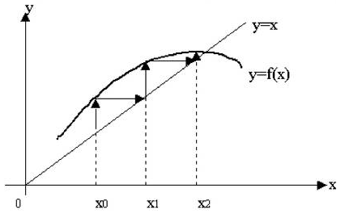

# Приближённые вычисления
Разработать программу для приближённого нахождения корня уравнения f(x) = 0 для нескольких (не менее 5) функций. Функции f(x) берутся из задачника – лабораторный практикум по курсу «Основы программирования», лабораторная работа № 5. Номер функции вводится. Для выбора функции **не** использовать операторы выбора _if_ и _case_.

Корень уравнения находится тремя методами – методом секущих, методом простых итераций и методом Ньютона. Функция, для которой ищется корень, передаётся в процедуру, реализующую метод нахождения корня, с помощью функционального типа.

Для определения начального приближения необходимо построить график функции.

Корень уравнения определяется с заданной точностью ε. Для каждого метода нужно также  считать количество итераций, необходимых для вычисления корня. Осуществлять выход из цикла, когда количество итераций превышает заданное значение. Количество итераций  передавать в основную программу по желанию пользователя через параметр типа указатель на целое со значением по умолчанию, равным nil.

В качестве результата нужно вывести значение корня, значение функции в корне и количество итераций или сообщение о том, что превышено максимально допустимое количество итераций. Количество знаков после десятичной точки должно соответствовать введённой точности.

Осуществлять проверку аномалий. Для завершения выполения программы можно использовать  операцию exit.


## МЕТОД ПРОСТЫХ ИТЕРАЦИЙ.
Используется в том случае, если уравнение можно выразить в виде x = f(x).
Тогда корень уравнения является пересечением прямой y=x и кривой y=f(x).
Данный метод записывается в виде рекуррентной формулы:

```
		x_0 = x начальное
        x_i = f(x_(i-1)) для i ∈ ℕ.
```
образующая последовательность _x\_1, x\_2, x\_3..._, сходящуюся к корню
уравнения при определённых условиях. Повторяем процесс до выполнения ус-я

```
		|x_i - x_(i-1)| ⩽ ε
```


## МЕТОД  СЕКУЩИХ.


Критерий остановки `|x^k - x^(k-1)| < e`  или `f(x^k) < e`.